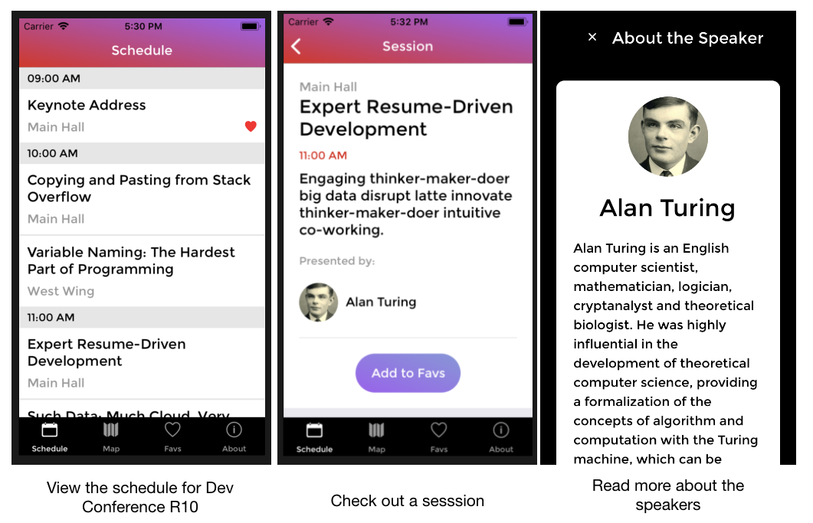

# ADP Project 4: R10

- Author: P. Chong, ADP Student @ RED Academy 2018 Q3

## Description and Objective:

- The objective for this project was to create a mobile application for a developer conference called 'R10'. The app is designed to be android and ios compatible. It allows users to view a schedule of sessions, details for individual sessions, and to 'favourite' a session (so that they have a list of sessions they are interested in)
- In addition, users can read about speakers for each session and navigate to an external link to read more about the speakers

## Questions and Learnings

- React Native
  - This project was the first project we built using react.native (RN). RN allows for much of the React code we write to be reuseable when programming for android and ios. This can happen because of RN's bridges, which take the code we write and convert it into something that ios and android can understand, respectively.
- Similar but different
  - React and React.Native both use components. However RN does not use any HTML. For example, there aren't h1, h2, p etc. Instead, <Text> is used for all text.
- Mobile screens are so small!
  - Some helpful tools offered by RN to combat this are TouchableHighlight and TouchableOpacity - which are both great for coarse pointers
  - ScrollView allows for more information to be displayed than can fit on the screen at one time
- Navigation in RN
  - RN uses stack navigation to manage transitions and histories. Navigation also knows that it can create things such as drawers (android) and tab bars (ios), which allow for easy navigation through the app.

## Using:

FrontEnd:

- React
- React Native

Backend

- Realm
- Apollo Boost
- GraphQL

## Set Up

1. Download the repo
1. Run
   `npm install`
1. Run `react-native run-ios` or `react-native run-android`

## Goals for Future Improvement:

- Map implementation
  - Due to constraints in time, I did not get a chance to attempt the addition of google maps but I would like to do that in the future
- Custom Icon and Splash
  - To further improve the UI, a custom app icon and splash screen for loading could be added
